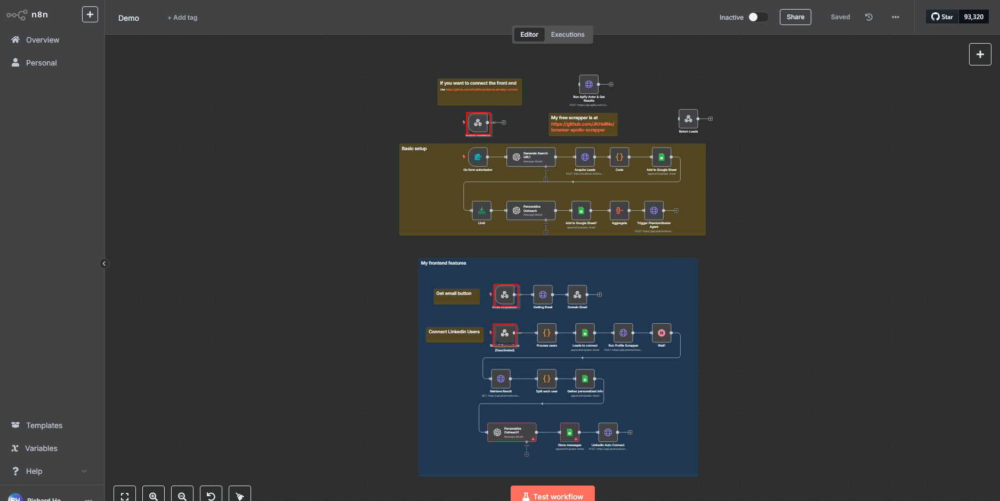
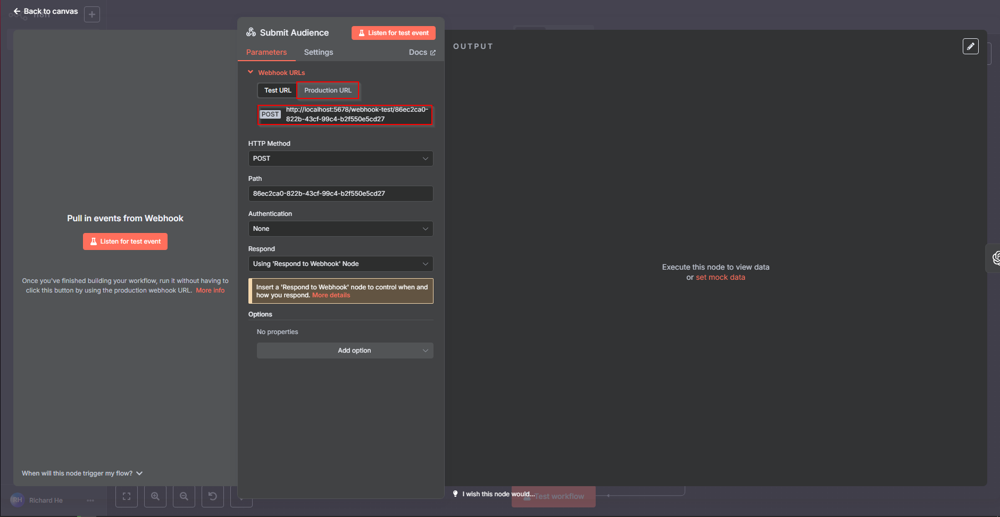
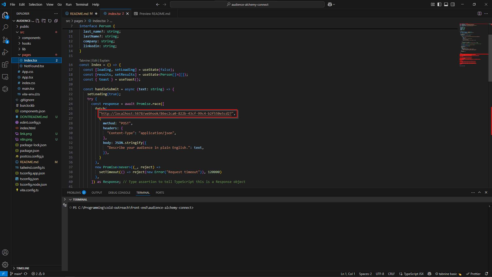

# Welcome to Frontend

## Project info
```
You only have to change three fields
1. Update the fetch in src/pages/Index.tsx for audience submission.
2. Update the fetch in src/components/ResultsTable.tsx for fetching emails.
3. Update the fetch in src/components/ResultsTable.tsx for submitting LinkedIn connections.
Make sure to open each respective webhook nodes(screenshot below), copy the POST URL (I recommend using the Production URL) and replace the fetch url for each field


```






